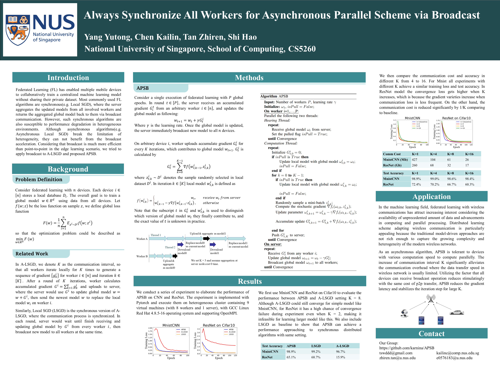

# APSB: Always Synchronize All Workers for Asynchronous Parallel Scheme via Broadcast
Federated Learning (FL) has enabled multiple mobile devices to collaboratively train a centralized machine learning model without sharing their private dataset. Most commonly used FL algorithms are synchronous(e.g. KSGD), where the server aggregates the updated models from all involved workers and returns the aggregated global model back to them via broadcast communication. However, such synchronous algorithms are also susceptible to performance degradation in heterogeneous environments. Although asynchronous algorithms(e.g. KASGD) break the limitation of heterogeneity, they can not benefit from the broadcast acceleration. Considering that broadcast is much more efficient than point-to-point in the edge learning scenario, we tried to apply broadcast to KASGD and proposed APSB.

## Poster
### [APSB Poster](APSB-Poster-36x48-final.pdf)

## Group Members
Yang Yutong, Chen Kailin, Tan Zhiren, Shi Hao

## Course Info
Projects for National University of Singapore, School of Computing, [CS5260 Neural Networks and Deep Learning II Module](https://nusmods.com/modules/CS5260/neural-networks-and-deep-learning-ii).
